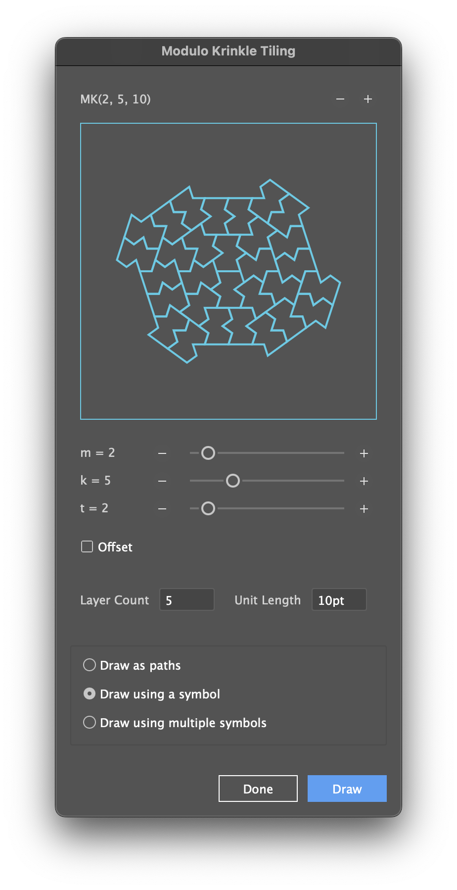

# Modulo Krinkle Tiling for Adobe Illustrator

Extendscript tool to generate Modulo Krinkle tiling, as described in:
[Miki Imura, *A new non-periodic tiling based on modulo arithmetic*, arXiv:2506.07638](https://arxiv.org/abs/2506.07638)

Huge thanks to Miki for discovering this tiling and sharing with us!

## Usage

From Adobe Illustrator, run the script file **Draw Modulo Krinkle Tiling.js** and you will see the interface (see below). Explore the parameters, set the drawing options and click "Draw" to generate the tiling.

---

## Installation

### Step 1: Download the Scripts

Download script files (zipped):

The repository contains the following script files:

- **Draw Modulo Krinkle Tiling.js** - start here!

Helper files (required):

- MK_Drawing.js - contains drawing code specific to Adobe Illustrator.
- MK_UI.js - contains code for the UI.
- MK.js - contains code for generating the MK Tiling.

Other files:

- Other Drawing Examples.js - contains some examples of custom drawing functions.

> Note: Ensure that **Lib** folder and all its files are in the same folder as the **Draw Modulo Krinkle Tiling.js** script file.

---

## Author

All code in this repo is by Mark Bean ("[m1b](https://community.adobe.com/t5/user/viewprofilepage/user-id/13791991)"), inspired by a lifelong love of tiling patterns.

## Acknowledgements

The Modulo Krinkle Tiling was created by Miki Imura, author of the paper [*A new non-periodic tiling based on modulo arithmetic*, arXiv:2506.07638](https://arxiv.org/abs/2506.07638). See also [Miki's tiling web page](https://mk.tiling.jp/).

## License

This project is open-source and available under the MIT License. See the [LICENSE](LICENSE) file for details.
